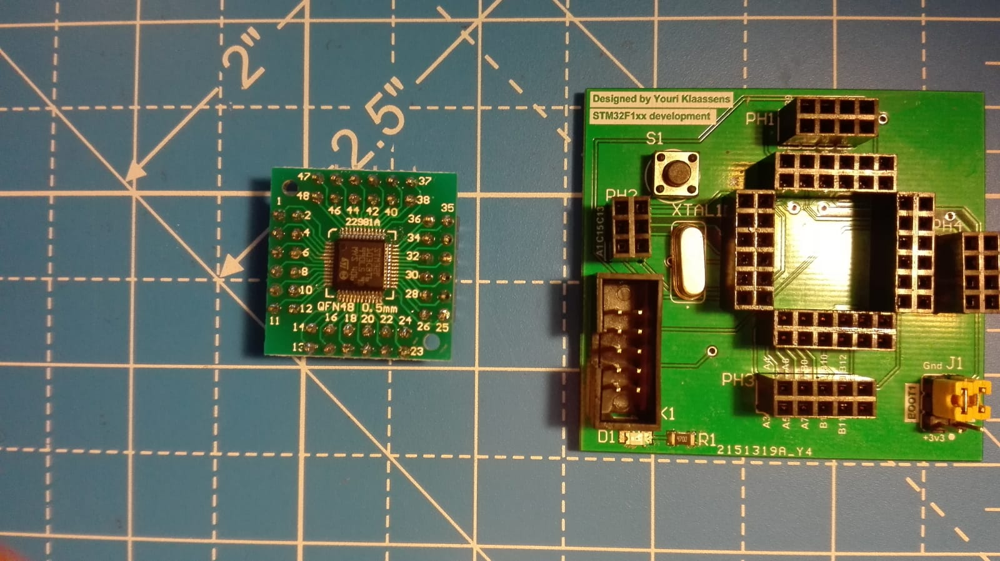
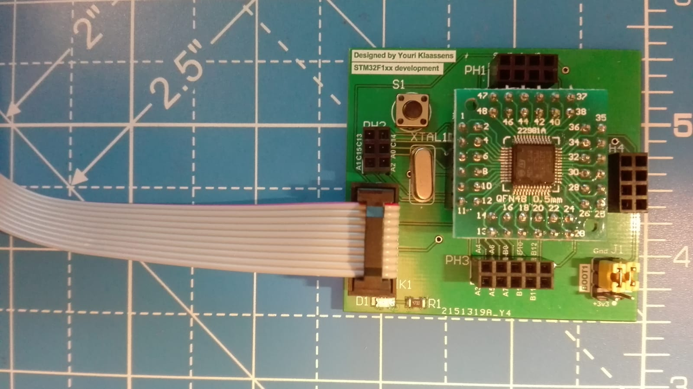

# XhenRTOS_Development_Board
Firmware and schematic for the XhenRTOS development board

## Table of Contents

1. [Overview](#section-features)
2. [Phases](#section-phases)

## [Overview](id:section-features)

This repository contains firmware and schematics for the XhenRTOS development board. The target microcontroller on which XhenRTOS will run is the STM32F103CBT6. Before XhenRTOS is programmed, test programs written for individual subsystems. Those subsystems are:
* Nokia5110 (display)
* 0.91" OLED (display)
* MCP9808 (temperature sensor)
* ESP8266 (Wi-Fi)
* TBD

After the implementation of XhenRTOS, these programs are used as a basis for integration with XhenRTOS to control all these subsystems real time. 
Integration with XhenRTOS should be published in this repository and functions as a prove and example to use XhenRTOS.

## [Phases](id:section-phases)

The realization is divided into different phases:

### Phase 1.

This is the initial phase. The package of the STM32F103CBT6 is LQFP48. This package does not fit in a breadboard, so a breakout Printed Circuit Board (PCB) must be designed.
Designing and manufacturing (see two Figures below) this PCB  is part of phase 1. The breakout board has a 10 pin JTAG connector to directly connect the ST-Link V2. BOOT0 and BOOT1 are routed so the location of the binary we want to flash can be determined using two jumpers. There is a 12 MHz external crystal with appropriate ceramic capacitors so we can generate a 72 MHz clock frequency.
  
 
